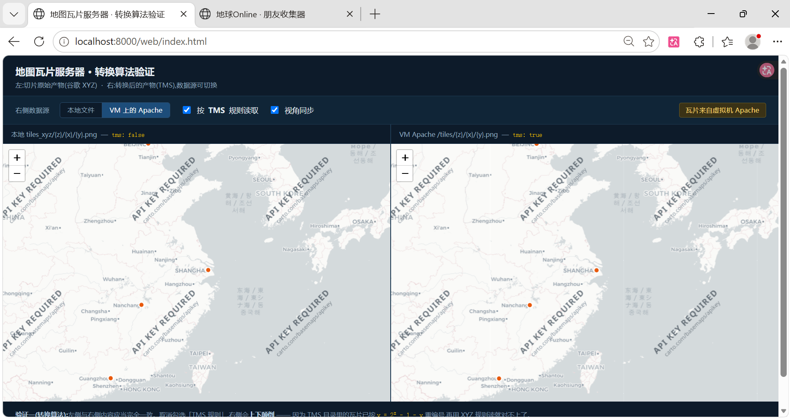
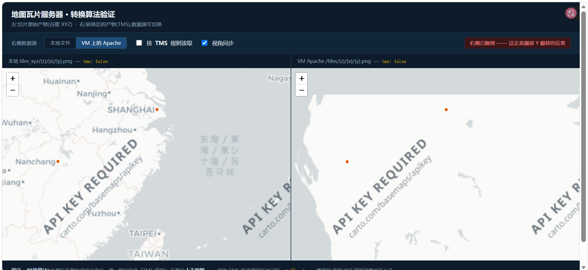
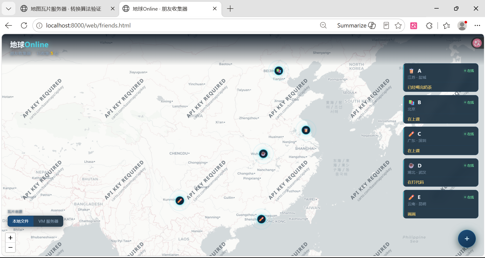
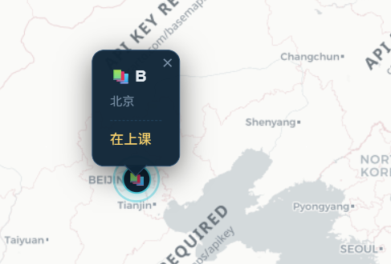
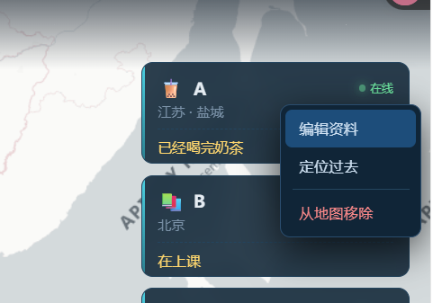
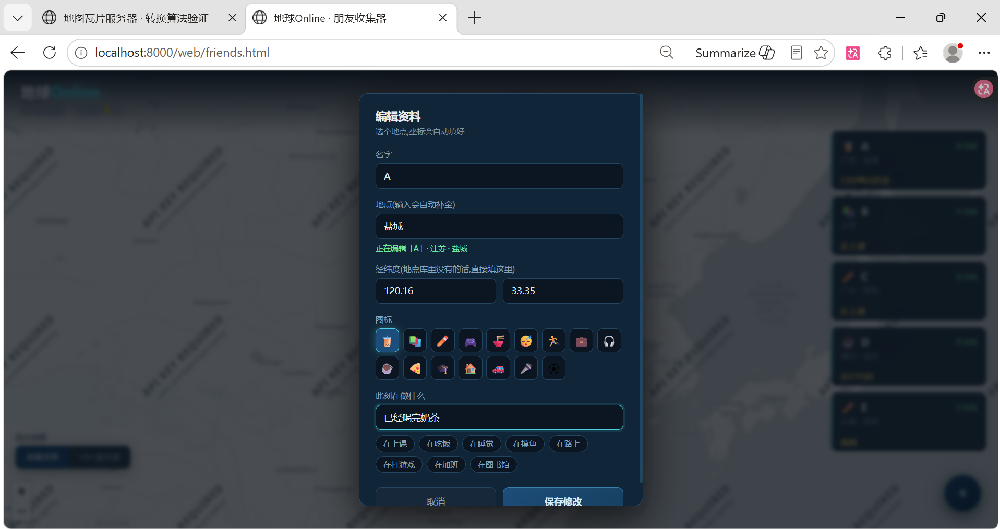

# 一、地图服务器搭建

本项目用以复刻论文《基于 OSGEarth 的地图数据服务器构建方法》，并作简要开发示例。

> 罗丽虹, 孙卡, 赵杰, 周燕. 计算机应用与信息技术与信息化, 2024(12): 32-36.
> DOI: 10.3969/j.issn.1672-9528.2024.12.006
>
> - CNKI（知网）：https://www.cnki.com.cn/Article/CJFDTotal-SDDZ202412009.htm 
> - 官方PDF：https://www.sdie.org.cn/staticjt/upload/file/20251021/1761010175729446.pdf 

---

**目  录**

- [一、地图服务器搭建](#一地图服务器搭建)
  - [1.1 系统描述](#11-系统描述)
  - [1.2 复刻范围](#12-复刻范围)
  - [1.3 搭建环境](#13-搭建环境)
    - [1.3.1 目录结构](#131-目录结构)
    - [1.3.2 瓦片级别分布](#132-瓦片级别分布)
  - [1.4 搭建步骤](#14-搭建步骤)
    - [1.4.1 准备瓦片数据](#141-准备瓦片数据)
    - [1.4.2 转换成 TMS 目录结构](#142-转换成-tms-目录结构)
    - [1.4.3 部署到 Apache 服务器](#143-部署到-apache-服务器)
    - [1.4.4 从宿主机传数据并跨机器验证](#144-从宿主机传数据并跨机器验证)
    - [1.4.5 踩坑记录](#145-踩坑记录)
  - [1.5 效果展示与 index.html 讲解](#15-效果展示与-indexhtml-讲解)
    - [1.5.1 页面构成](#151-页面构成)
    - [1.5.2 三个验证点](#152-三个验证点)
    - [1.5.3 效果图](#153-效果图)
    - [1.5.4 量化数据](#154-量化数据)
    - [1.5.5 存储量外推](#155-存储量外推)
- [二、应用实践展示](#二应用实践展示)
  - [2.1 简要介绍](#21-简要介绍)
  - [2.2 总体设计](#22-总体设计)
    - [2.2.1 功能](#221-功能)
    - [2.2.2 数据结构](#222-数据结构)
  - [2.3 后续工程建议](#23-后续工程建议)

---

## 1.1 系统描述

​		**把地图的金字塔瓦片下载下来 → 转换成服务器要的目录结构 → 用 Apache 提供局域网访问 → 客户端加载成地图。**

```
①  下载瓦片 ──► ②  切片/整理 ──► ③  转成 TMS 目录 ──► ④  Apache 托管 ──► ⑤  客户端加载
   在线瓦片 API      金字塔分层           Y 轴翻转            httpd            Leaflet
```

论文的四个环节是:下载瓦片与 DEM → 瓦片转换算法 → 搭建 Apache 服务器 → 客户端可视化。
本项目复刻了其中三个,并把可视化端从 OSGEarth 换成了浏览器。

---

## 1.2 复刻范围

| 论文 | 本项目 | 说明 |
|:-:|:-:|:-:|
| BIGEMAP / 水经注下载谷歌影像 | `download_tiles.py` 调在线瓦片 API | 数据同为标准 Web Mercator 瓦片 |
| 谷歌 DEM 高程数据 | - | 三维地形需要,二维预览用不上 |
| VS2010 + Qt + OpenCV 转换工具 | `convert_tiles.py` | 算法逻辑一致 |
| 瓦片等级转换(论文公式 5、6) | `y_new = 2^z - 1 - y` + 目录重排 | 原文公式是图片,按描述推导 |
| 存储格式转换(PNG/JPG/Mixed) | `--dst-fmt` 参数 | |
| Apache 服务器 | CentOS Stream 10 + httpd | |
| 磁盘阵列 RAID0 / DAS 直连存储 | - | 硬件,1365 张瓦片只有 4.39 MB |
| OSGEarth 三维地球 | Leaflet 二维 | OSG 编译成本极高,二维足以验证数据链路 |
| `tms.xml` 描述文件 | - | OSGEarth 专用,Leaflet 用 `tms: true` 代替 |

---

## 1.3 搭建环境

| 角色 | 配置 |
|---|---|
| 开发机 | Windows 11 + Python 3.13 + Pillow |
| 虚拟机 | VMware Workstation 17.5.0 (build-22583795) |
| 服务器系统 | CentOS Stream 10 |
| 服务器软件 | httpd 2.4.63 / SELinux Enforcing / firewalld |
| 前端 | Leaflet 1.9.4(本地文件,不依赖 CDN) |
| 网络 | VMware NAT,VM 地址 `192.168.247.129` |

### 1.3.1 目录结构

```
mapserver/
├── gen_source.py        生成测试用源图(带经纬网+地标的墨卡托世界图)
├── slice_tiles.py       把源图切成谷歌 XYZ 金字塔
├── download_tiles.py    从在线瓦片服务下载真实瓦片(支持断点续传)
├── convert_tiles.py     XYZ → TMS 转换算法 + 格式转换 + 翻转自检
├── source/world.png     源图(4096×4096)
├── tiles_xyz/           XYZ 目录结构的瓦片(1365 张)
├── tiles_tms/           TMS 目录结构的瓦片(1365 张)
├── images/              截图目录
└── web/
    ├── index.html       技术验证页(左右对比 + 数据源切换)
    ├── friends.html     应用实践页(地球Online 朋友收集器)
    ├── locations.js     地点库(138 条城市数据)
    ├── leaflet.js       本地 Leaflet 1.9.4
    └── leaflet.css
```

### 1.3.2 瓦片级别分布

| 级别 | 瓦片数 | 说明 |
|---|---|---|
| z=0 | 1 | 整个世界一张 |
| z=1 | 4 | 每降一级,数量 ×4 |
| z=2 | 16 | |
| z=3 | 64 | |
| z=4 | 256 | |
| z=5 | 1024 | |
| **合计** | **1365** | 实际数据 4.39 MB,磁盘占用约 7.3 MB |

---

## 1.4 搭建步骤

### 1.4.1 准备瓦片数据

两种方式,任选其一。

**方式 A —— 用生成的测试图(不联网):**

```bash
python gen_source.py                       # 生成带经纬网的源图
python slice_tiles.py --max 5              # 切成 XYZ 金字塔
```

`gen_source.py` 画的是一张带经纬网格和地标的墨卡托世界图,用来自查投影是否正确 ——
网格线在 Leaflet 里对得上,说明投影没问题。

**方式 B —— 下载真实地图瓦片(需要联网):**

```bash
python download_tiles.py --max 5           # 默认 CartoDB 浅色底图
python download_tiles.py --source esri     # 或换 Esri 卫星影像
```

下载器带**断点续传**(已存在的文件自动跳过)、失败重试和并发控制。

> 实测:1280 张瓦片 / 24 线程 / 535 秒,成功 1276 张,4 张超时由断点续传补齐。
>
> **注意不同服务商的 URL 模板参数顺序不同**:CartoDB 是 `{z}/{x}/{y}`,Esri 是 `{z}/{y}/{x}`。
> 这是瓦片服务里最常见的坑之一,换源时必须逐个核对。

### 1.4.2 转换成 TMS 目录结构

```bash
python convert_tiles.py --clean
```

输出会逐级显示转换数量,末尾是翻转自检:

```
  z=0       1/1      张  Y翻转  y -> 0 - y   [OK]
  ...
  z=5    1024/1024   张  Y翻转  y -> 31 - y  [OK]

翻转自检(哈希比对:转换前后的瓦片内容应当交叉相等):
    TMS 1/0/0 (南半球)  ==  XYZ 1/0/1   ->  一致
    TMS 1/0/1 (北半球)  ==  XYZ 1/0/0   ->  一致
  -> 通过:行号确实翻转了,内容一一对应
```

**存储格式转换**(论文 3.2.2):

```bash
python convert_tiles.py --dst tiles_jpg --dst-fmt jpg --clean
```

### 1.4.3 部署到 Apache 服务器

在 **CentOS 服务器**上执行:

```bash
# 安装并启动
sudo dnf install -y httpd
sudo systemctl enable --now httpd

# 放行防火墙(两步都不能少)
sudo firewall-cmd --permanent --add-service=http
sudo firewall-cmd --reload
sudo firewall-cmd --list-services          # 确认输出里有 http

# 部署瓦片
sudo mkdir -p /var/www/html/tiles
sudo cp -r /tmp/tiles_tms/. /var/www/html/tiles/
sudo restorecon -Rv /var/www/html/tiles    # SELinux 打标签,不能省
find /var/www/html/tiles -name '*.png' | wc -l    # 应为 1365

# 配置虚拟目录
sudo tee /etc/httpd/conf.d/tiles.conf > /dev/null <<'EOF'
Alias /tiles "/var/www/html/tiles"

<Directory "/var/www/html/tiles">
    Require all granted
    Options Indexes FollowSymLinks
</Directory>
EOF

sudo apachectl configtest                  # 改配置必测语法
sudo systemctl reload httpd

# 服务器本地验证
curl -I http://127.0.0.1/tiles/0/0/0.png
curl -sI http://127.0.0.1/tiles/0/0/0.png | head -3   # 看 Server 头
```

`Server: Apache/2.4.63 (CentOS Stream)` 才是 Apache 在答话 —— **不能只看 200**。

### 1.4.4 从宿主机传数据并跨机器验证

```bash
# 传文件(scp 用相对路径,避开盘符被误判为主机名)
cd /e/2026/mapserver
scp -r tiles_tms ningningko_2003@192.168.247.129:/tmp/

# 跨机器验证
curl -I http://192.168.247.129/tiles/0/0/0.png
```

### 1.4.5 踩坑记录

| 现象 | 原因 | 解法 |
|---|---|---|
| 403 但 `ls -l` 权限全开 | SELinux 标签不对 | `restorecon -Rv` 或 `semanage fcontext` |
| VM 内正常,外面不通 | firewalld 没放行 | `--permanent --add-service=http` **和** `--reload`,两步都要 |
| `scp E:/path ...` 报"找不到文件" | Windows 盘符的冒号被当成主机分隔符 | 用相对路径,先 `cd` 再传 |
| 后台任务输出文件一直空 | Python 往管道写是块缓冲 | 看磁盘产出,不用 `-u` 看不到实时输出 |
| 服务 kill 掉自己复活 | systemd 托管 | 这是特性,不是 bug |
| 地图加载正常但上下颠倒 | XYZ/TMS 的 Y 轴搞反 | `y_tms = 2^z - 1 - y` |
| 换瓦片源后 URL 全 404 | 服务商模板参数顺序不同 | Esri 是 `{z}/{y}/{x}`,CartoDB 是 `{z}/{x}/{y}` |
| 放大后画面模糊 | 该级别瓦片没下载 | `maxNativeZoom` 设成实际存在的最高级别 |

---

## 1.5 效果展示与 index.html 讲解

### 1.5.1 页面构成

`web/index.html` 是**技术验证页**,左右并排两张地图:

| 位置 | 内容 | 用途 |
|---|---|---|
| 左 | `tiles_xyz/{z}/{x}/{y}.png`, `tms: false` | 切片原始产物 |
| 右 | 数据源可切换,`tms` 开关可切换 | 验证转换结果 |
| 顶部工具栏 | 数据源切换 / TMS 规则开关 / 视角同步 | 三个验证开关 |
| 底部 | 两段说明文字 | 讲清验证逻辑 |

### 1.5.2 三个验证点

**验证一 —— 转换算法对不对**

左右两张图内容应当**完全一致**。取消勾选「TMS 规则」,右侧立刻**上下颠倒** ——
因为 TMS 目录里的瓦片已按 `y = 2^z - 1 - y` 重编号,再用 XYZ 规则读就对不上了。

**验证二 —— 服务器部署对不对**

把数据源切到「VM 上的 Apache」,瓦片改由虚拟机里的 httpd 提供。
如果画面和本地一模一样,说明:Apache 部署正确、SELinux 标签正确、防火墙放行正确。

**验证三 —— 底图与标记是否分离**

地图上的城市标记由客户端绘制。底图翻转时**标记点不跟着动** ——
「北京」会落到地图下半部分,一眼看出底图有问题。

### 1.5.3 效果图







### 1.5.4 量化数据

| 指标 | 数值 |
|---|---|
| 瓦片总数 | 1365 张(z0~z5) |
| **实际数据量** | **4.39 MB**(4,606,886 字节) |
| **磁盘占用** | **约 7.3 MB** |
| 平均单片 | 3.30 KB |
| 下载耗时 | 1280 张 / 535 秒(24 线程并发) |
| 单片平均耗时 | 约 0.42 秒 |
| 下载成功率 | 1276/1280 = 99.7%(4 张超时,断点续传补齐) |
| 代码量 | Python 548 行 + 前端 1094 行(含地点库 163 行) |

> **4.39 MB 和 7.3 MB 的差额值得注意**:1365 个文件平均只有 3.30 KB,而文件系统按块分配(通常 4 KB 一块),**不足一块也要占满一块**。约 66% 的额外占用就是这么来的。
>
> 这是海量小文件存储的固有开销,也是瓦片服务普遍采用打包格式(MBTiles)、对象存储或直接上 SSD 的原因。**一个 5 KB 的瓦片和一个 4 KB 的瓦片,在磁盘上一样大。**

### 1.5.5 存储量外推

z 级瓦片数为 `4^z`,数据量随级别指数增长:

| 级别 | 瓦片数 | 累计 |
|---|---|---|
| z5 | 1,024 | 1,365 |
| z10 | 1,048,576 | 约 140 万 |
| z15 | 1,073,741,824 | 约 10.7 亿 |
| z18 | 68,719,476,736 | 约 687 亿 |

按实测单片 3.30 KB 推算,z18 单级别数据量约 **210 TB**(算上块开销还要更多)。
这正是论文说"全国地图需要硬盘达到百 TB 以上"的由来,也解释了为什么真实地图服务必须用**金字塔 + 按需加载**:客户端只请求视野内那几十张瓦片,而不是把整库拉下来。

---

# 二、应用实践展示

当前版本仅实现了前端效果打版，后端、数据库及相关容器部署。

## 2.1 简要介绍

`web/friends.html` —— **地球Online · 朋友收集器**。

基于该项目的服务器实现方法，重写前端样式及简单逻辑功能，实现好友位置与状态标注、可交互信息录入界面等有趣功能。



## 2.2 总体设计

### 2.2.1 功能







| 功能 | 说明 |
|---|---|
| 悬浮加人按钮 | 右下角圆形 `+`,点开弹出表单 |
| 地点自动定位 | 输入城市名自动补全,选中后**坐标自动填好** |
| 手动填坐标 | 地点库里没有的,直接填经纬度 |
| 图标选择 | 16 个候选 emoji |
| 状态备注 | 自由输入 + 一排快捷标签 |
| 右键菜单 | **编辑资料 / 定位过去 / 从地图移除** |
| 开场动画 | 先给全球视野,再自动飞到刚好装下所有人的范围 |
| 本地存档 | 数据存浏览器 `localStorage`,刷新不丢 |

### 2.2.2 数据结构

地点库拆成了独立文件 `locations.js`,**数据与逻辑分家**,加地点不用碰主文件:

```js
window.LOCATIONS = [
  { name: "盐城", lon: 120.1398, lat: 33.3776, city: "江苏 · 盐城", tier: 4 },
  // name  输入框里敲的名字(浏览器做包含匹配)
  // city  地图弹窗上显示的那行
  // tier  分级标记(1 一线 / 2 新一线 / 3 二线 / 4 三线)
];
```

现有 **138 条城市**:一线 5、新一线 17、二线 32、三线 84。

## 2.3 后续工程建议

| 工程项 | 要解决的问题 | 涉及技术 |
|---|---|---|
| 后端 API + 数据落盘 | 朋友数据只在本机浏览器,无法共享、无法备份 | Flask / FastAPI + JSON 文件或 SQLite |
| 地点库改为接口下发 | 加城市要改源码,数据与代码耦合 | REST 接口 + 前端异步加载 |
| nginx 对比部署 | 缺海量小文件托管的性能基线 | nginx 配置 + ab / wrk 压测 |
| HTTP 缓存头 | 瓦片被反复请求,客户端无缓存 | `Expires` / `Cache-Control` |
| 并发压测 | 不知道这台服务器能扛多少并发 | ab / wrk / JMeter |
| PNG / JPG 格式对比实测 | 论文 3.2.2 的结论未经验证 | `convert_tiles.py --dst-fmt` |
| `tms.xml` 生成 | 论文图 8 未复刻,OSGEarth 无法直读 | XML 组织 |
| DEM 高程 + 三维地形 | 论文的高程环节未做 | 高程瓦片 + Cesium |

